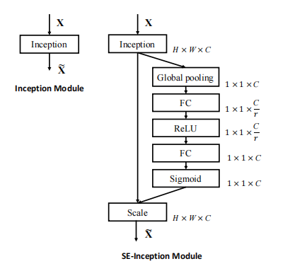

# Squeeze-and-Excitation Networks

---

**URL:** https://arxiv.org/abs/1709.01507

**Code:** https://github.com/hujie-frank/SENet

**Jnl/Conf:** CVPR 2018

**Rate:** ★★★★

---

## 论文简介

文章提出SENet，并希望引入SE block来建立不同通道之间的依赖关系来增强网络的表示能力，
通过一个自适应校准机制，利用全局信息来选择性的强调有益信息而抑制相对无用的信息。最终
以较小的计算量增加为代价得到了较大的网络性能提升。

## 方法

1 通过一个卷积操作（Ftr）实现 X->U 的转换，卷积核定义为, C表示通道数， 最后输出, 第C个通道输出计算公式如下：

2 全局池化操作。由于每个filter只能利用局部信息，U中的每个单元也就无法利用此区域外
的上下文信息，为了能使其具有全局感受野，用全局平均池化将全局空间信息压缩为一个实数，
其中，对于z的第c个元素，计算公式如下：

3 自适应重新校准。 使用一个两层的非线性全连接网络，公式如下：

4 将学习到的z（即每个通道的权重）与对应通道做乘法（相当于对U进行了放缩）。

## 创新点总结和思路借鉴

提出了SE block，利用全局信息显示建立通道间的依赖关系, 创新性的将注意力机制应用于CV领域，通过实验中验证，将SE块嵌入到目前已有的模型中，网络性能得到明显提升。
对于自适应重新校准各个特征通道权重中使用的两层全连接神经网络，也可以尝试使用其它结构的网络来实现。
