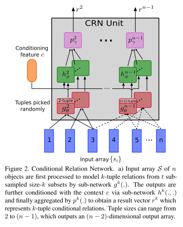
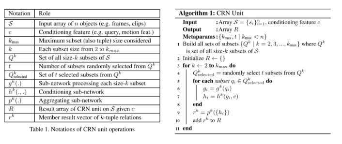
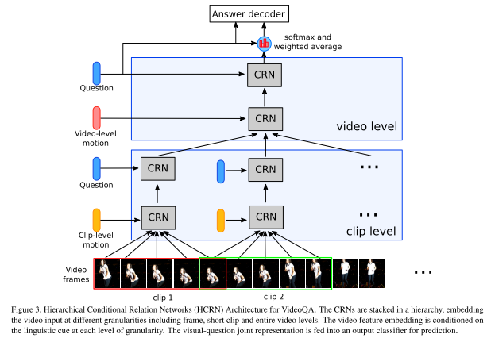

# Hierarchical Conditional Relation Networks for Video Question Answering

---

**URL:** https://arxiv.org/pdf/2002.10698.pdf

**Code:** https://github.com/thaolmk54/hcrn-videoqa

**Jnl/Conf:** CVPR 2020

**Rate:** ★★★★

---

## 论文简介

 当前对QA视频建模的方法是构建神经架构，其中每个子系统都是为特定的定制目的或特定的数据模式而设计的。由于这种特殊性，这种手工制作的架构对于数据模式的变化、视频长度的变化或不同问题的解决往往不是最佳的。这导致了异构网络的大量激增。
   本文介绍了称为条件关系网络（CRN）的通用神经单元，以及一种使用CRN作为构建块构建视频QA层次网络的方法。CRN是一种关系变换器，它根据上下文特征将一个张量对象数组封装并映射为一个新的同类数组。在此过程中，输入对象之间的高阶关系通过条件特征进行编码和调制。这种设计允许灵活构建复杂结构，如堆栈和层次结构，并支持迭代推理，使其适合多模态和结构化领域（如视频）的QA。HCRN在多个VideoQA数据集（TGIF-QA、MSVD-QA、MSRVTT-QA）上进行评估，证明具有竞争推理能力。

## 方法

### CRN
   条件关系网络（CRN)将N个对象的数组和一个条件特征c都放在同一个向量空间Rd或者张量空间R^(W×H×d)
中作为输入，CRN生成一个相同维度的对象的输出数组，其包含给定上全局下文的输入特征的高阶对象关系，如 Figure 2 中所显示。CRN模块的运行流程参见 Table 1 和 Algorithm 1.

### HCRN
  通过对CRN block 的不同堆叠和排列，组成分层条件关系网络（HCRN）结构，在最低层次上，CRN对剪辑中的帧外观之间的关系进行编码，并将剪辑运动作为上下文进行集成；该输出在下一阶段由crn进行处理，CRN现在集成在语言上下文中；在下一阶段，CRN捕获剪辑编码之间的关系，并作为上下文集成在视频运动中；在最后阶段，CRN将视频编码与语言特征作为上下文集成。该模型通过允许CRN分层堆叠，自然地支持视频和关系推理中的分层结构建模；通过允许分阶段引入适当的上下文，该模型处理多模式融合和多步骤推理。模型具体结构如 Figure 3 所示。

## 创新点总结和思路借鉴

  1，介绍了一种通用的神经网络单元条件关系网络（CRNs）和一种以CRNs为构建块的视频质量保证分层网络的构造方法。CRN是一个关系变换器，它根据上下文特征将一个张量对象数组封装并映射成一个同类的新数组。在此过程中，输入对象之间的高阶关系被条件特征编码和调制。
  2，与基于时间注意的视频对象选择方法不同，HCRN侧重于视频中关系和层次的建模。这种方法和设计选择上的差异带来了显著的好处。CRN单元可以通过注意机制进一步增强，以覆盖更好的对象选择能力，从而可以进一步改进诸如帧QA之类的相关任务。
