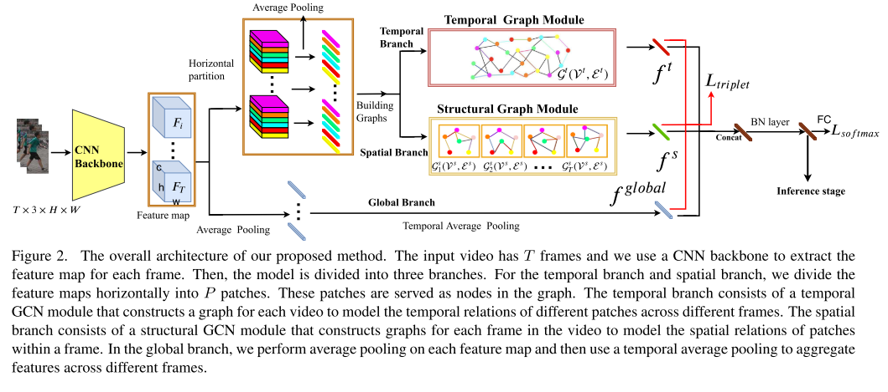
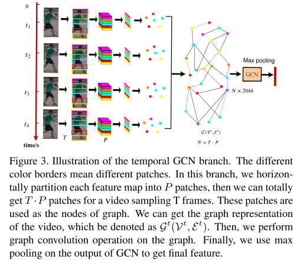
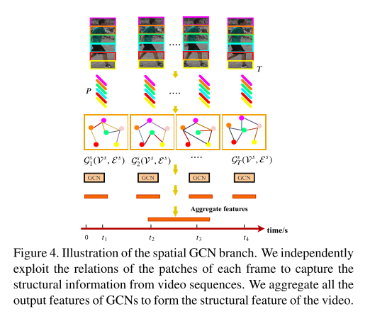

# Spatial-Temporal Graph Convolutional Network for Video-based Person Re-identification

---

**URL:** https://openaccess.thecvf.com/content_CVPR_2020/papers/Yang_Spatial-Temporal_Graph_Convolutional_Network_for_Video-Based_Person_Re-Identification_CVPR_2020_paper.pdf

**Code:** 

**Jnl/Conf:** CVPR 2020

**Rate:** ★★★★

---

## 论文简介
  在基于视频的人物识别（re-ID）任务中存在一些挑战，比如视觉相似阴性样本的遮挡问题和视觉模糊问题。同时，作者发现不同帧可以为彼此提供互补信息，行人的结构信息可以为外观特征提供额外的辨别线索。文章提出了时空图卷积网络(STGCN)，希望通过对不同帧的时间关系和帧内的空间关系进行建模来解决这一问题。
 
## 方法

设计了3个分支， 上部分支是用于从相邻帧上的斑块中提取时间线索的时间分支， 中间分支是通过对空间关系建模来提取人体结构信息的空间分支， 底层分支是提取行人外观特征的全局分支。
首先把每一帧放到CNN中，得到Fi ∈ Rh×w×c，F ={F1,F2,...,FT}，T为帧数。再把每个feature map Fi水平切分成P个patch，pi = 1,...,N。patch数量N为T * p, 把每个P做平均池化后得到patch特征向量为xi ∈ Rc, i =1,...,N.
用GCN去学习patches之间的关系。 G(V,E)有N个节点，vi ∈ V,eij = (vi,vj) ∈E. 每个patches就是图中的节点，边e代表他们之间的关系。 A ∈ RN×N是这个图的邻接矩阵。

这个式子，表示两个patch的关系，φ表示原始面要素的对称变换，φ =wx。w是可通过反向传播学习的d×d维权重。这个变换的意义是：它允许我们自适应地选择和学习帧内或跨不同帧的不同补丁的相关性，结合其他节点的信息。

归一化处理：

自循环邻接矩阵:

近似图拉普拉斯：

### 时间分支

Xm是第m层隐层特征，X0是通过CNN获得的特征patch。 Wm是被学习的参数矩阵。每层图卷积后跟一个nomalization层用和LeakyRelu

最后使用Maxpooling作用于Xm 最后得到 ft ∈ R1×dm 是时域GCN特征，dm设置为2048

### 空间分支

独立地利用每一帧的块之间的关系来捕获视频序列中的结构信息。将GCNs的所有输出特征聚合在一起，形成视频的结构特征。

k为第i帧上的第k层图卷积。 Wik ∈ Rdk ×dk输出的经过Max pooling降维后的特征矩阵为：XiK ∈ RP ×256最后，将视频的特征连接起来，最后的特征表示为fs。

## 创新点总结和思路借鉴
 （1）利用GCN来模拟人体不同部位在一帧内和帧间的潜在关系，为人们提供更具鉴别力和鲁棒性的信息
 （2）提出了时空GCN框架来联合建模视频层的整体斑块关系和帧级的单个帧的结构信息，该框架可以学习斑块之间的区分和鲁棒的时空关系，从而促进基于视频的Re-ID。
