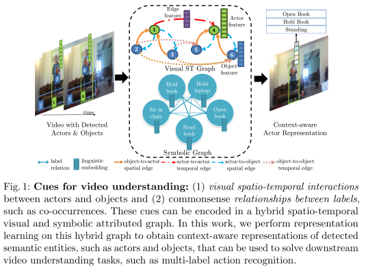
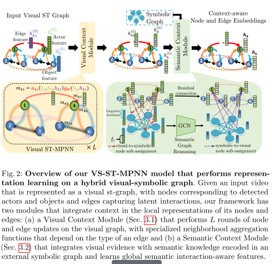

# Representation Learning on Visual-Symbolic Graphs for Video Understanding

---

**URL:** https://arxiv.org/pdf/1905.07385.pdf

**Code:** 

**Jnl/Conf:** ECCV 2020

**Rate:** ★★★★★

---

## 论文简介
   自然视频中的事件通常产生于演员和目标之间的时空交互，并且涉及多个共同发生的活动和目标类。因此，需要开发能够对时空视觉和语义上下文进行有效建模的算法。捕捉这种上下文的一种方法是使
用基于图的建模，它在计算机视觉中有着丰富的历史。传统的基于图的方法，例如使用概率图模型，主要侧重于在符号而不是信号/视觉表示的层次上对上下文进行建模。然而，最近的进步使得图结构化
数据的表示学习能够使用称为图神经网络（GNNs）的深层架构，这些架构学习如何通过聚合来自其邻居的消息来迭代更新节点表示。视频可以表示为视觉空间-时间属性图（视觉st图），其节点对应于由
目标检测器获得的区域，并且其边捕获这些区域之间的交互。GNNs最近被设计用于细化局部节点/边特征，该特征通常由卷积神经网络提取，基于由图捕获的时空上下文。虽然GNNs对视觉ST图的表示学
习已经导致了视频理解方面的重大进展，但是现有的方法有四个关键的限制，阻碍了它们充分利用这些图的丰富结构。

## 方法

VS-ST-MPNN模型的总体架构如图2所示。作者的目标是细化检测到的行为体的特征，目标和它们的基于两个图中捕获的上下文信息的交互：一个可视的st图和一个符号图。通过一种新的GNN来实现精化，该GNN a）
通过利用边特征和学习针对不同节点和边类型的专门的基于注意力的邻域聚合函数来利用视觉st图的丰富结构；b）通过结合一个语义推理模块（semantic reasoning module）和一个
软分配模块（soft-assignment module）来实现与符号图的融合，该语义推理模块学习语义关系感知特征，该软分配模块连接视觉和符号图节点，而不需要在训练期间访问区域的GT语义标签。然后上下文感知特征
可以用于下游的视频理解任务。

### VS-ST-MPNN模型
该模型在混合视觉-符号图上执行表示学习。给定一个表示为视觉st图的输入视频，其中节点对应于检测到的演员和目标，边捕获潜在的交互，作者的框架有两个模块将上下文集成在其节点和边的局部表示中：(a)视觉上下文模块（Visual Context Module）在视觉图上执行L轮节点和边更新，其具有依赖于边的类型的专门的邻域聚合函数，以及(b)语义上下文模块（ Semantic Context Module）将视觉证据与编码在外部符号图中的语义知识集成在一起，并学习全局语义交互感知特征。

具体包括：

视觉上下文模块。

1）视觉化st图。作者的输入是一个T帧序列，带有检测到的演员和目标区域。设Gv=(Vv，Ev）是一个空间-时间属性有向图，称为视觉st图，其中Vv是一个有限顶点集，Ev⊆Vv×Vv是一组边。节点对应于演员和目标检测，而边则建模潜在的交互。每帧有M个演员和N个目标。图2举例了一个玩具实例，其中M=1，N=2，T=2。

该图具有节点类型和边类型，其中有N个节点类型，ε 个边类型。例如，节点类型（N

=2）是演员和目标，边类型（ε =5）可以是：目标到演员空间的（obj-act-s），演员到目标空间的（act-obj-s），演员到演员 时间的（act-act-t）和目标到目标时间的（obj-obj-t）。每个节点和边与初始属性向量相关联，该初始属性向量的维数可根据节点/边类型而变化。演员/目标外观特征可以作为节点i(hi(0))的初始属性，而区域i、j的相对空间位置可以作为从j到i(hij(0))的边的初始属性。视觉st图的节点之间允许的空间-时间连接由二进制邻接矩阵Lv∈{0, 1}|Vv|×|Vv|的一个先验指定。例如，作者可以约束时间边来连接第t帧处的节点与时间t-1处的相同类型的另一个节点。Lv定义了每个节点的邻域，从而对模型捕获的时空交互的家族进行编码。

2）视觉ST-MPNN。给定具有初始节点{hi(0)}i∈Vv和边属性/特征{hij(0)}(i,j)∈Ev的输入视觉st图Gv，作者分别引入了新的GNN传播规则在视觉st图上执行表示学习，目标是利用时空上下文线索提炼局部节点和边属性。在每一次的节点和边提炼迭代中，作者的模型：（1）通过使用注意力系数提炼标量边权值来适应视觉st图的连通性；

（2）根据边的类型、基于注意力的标量边权重、连接节点的属性和边属性，沿每条边计算一条消息；

（3）通过聚集来自传入边的消息来更新每个节点的属性；

（4）通过使用在其旁边计算的消息更新每个边的属性。

语义上下文模块。

符号图。设Gs=（Vs，Es）为输入符号图，其中Vs和Es分别表示符号集和边集。这个图的节点对应于语义标签，如动作标签或目标标签。每个符号节点c与语义属性相关联，例如标签的语言嵌入（sc∈RK)。符号图中的边与标量权重相关联，标量权重编码标签关系，如共现。这些边权在固定邻接矩阵Ls∈R|Vs|×|Vs|中总结。

视觉证据与符号图的集成：作为第一步，作者使用视觉证据更新符号图的属性，即视觉st图节点的视觉上下文感知表示。为了实现这一点，作者不需要访问区域的GT语义标签，作者学习视觉图和符号图的节点之间的关联。关联权值表示将特征从视觉节点i分配给符号节点C的置信度。例如，当作者的符号节点对应于动作类时，作者可以禁用目标和符号节点之间的连接。在计算投票权重之后，每个符号节点与投影的视觉节点特征的加权和相关联。新的表示将每个符号图节点c计算为语言嵌入和视觉特征的拼接。

语义图推理：作者通过在符号图的节点上应用vanilla GCN来学习语义关系感知特征。GCN通过迭代应用传播规则:S(r+1)=GCN(S®, Ls)，得到演化的符号节点特征S®，其中S®表示在第r次迭代时符号节点嵌入的矩阵。

视觉化st-graph的更新：符号图上经过R次图卷积迭代后得到的演化符号节点表示可以映射为视觉st图，从而视觉节点的表示可以通过全局语义上下文得到丰富。为了实现这一点，作者计算符号节点到视觉节点的映射权重（注意力系数）。

## 创新点总结和思路借鉴

首先，作者通过结合符号图（捕获语义标签关系）和视觉st图（编码检测到的演员和目标之间的交互）来建模用于视频理解的上下文线索。
其次，作者提出了一种新的GNN，该GNN可以在混合视觉-符号图上进行联合表示学习，以获得演员、目标和目标的视觉和语义上下文感知表示以及它们在视频中的交互，它可以用来解决下游的识别任务。
最后，为了验证该方法的有效性和通用性，作者在三个具有挑战性的数据集上对multi-label temporal activity localization、object affordance detection和grounded video description等任务进行了评估，结果表明该方法达到了现有的性能。
