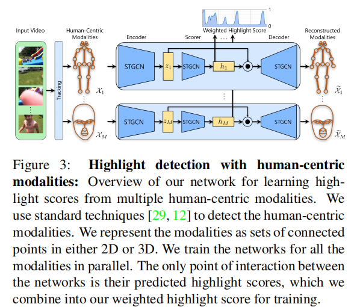

# HighlightMe: Detecting Highlights from Human-Centric Videos

---

**URL:** https://arxiv.org/pdf/2110.01774.pdf

**Code:** 

**Jnl/Conf:** IEEE 2021

**Rate:** ★★★★

---

## 论文简介
   作者发现未经过编辑的以人为中心的视频往往含有大量的用户不感兴趣的内容，需要进行编辑，为了解决这个问题， 实验人员开发了多种技术来检测高光的（即人类信息丰富的）摘录和总结视频。
过程为给定未经编辑的镜头，高光检测获取感兴趣的时刻，并计算出相关性和代表性最强的摘录集。希望能达到帮助用户加快浏览速度，还能提高这些高光区域被分享和推荐的机会这样一个效果。
## 方法
   目前的方法没有明确的模拟人类活动或者以人类为视频中心的焦点，而且在训练时都或多或少的需要一些特定领域知识，而本文的方法无需任何特定领域知识和用户偏好。
   本文方法对所有以人为中心的模态使用基于图的表示，来充分表示每个模态的固有结构如何随着时间的推移随着各种活动和交互而演变。我们的网络使用时空图卷积从这些基于图的表示中学习，并使用自动
编码器架构映射每帧模式来突出分数。突出分数是基于视频中所有帧的代表性，并且我们将连续的帧拼接在一起，以产生最终的摘录。文章方法首先识别人的相关信息， 姿势和面部信息，然后在时间和不同人
的交互方面进行一个编码，用来当做高亮分数，并以此来检测高亮区域。结果表明这个网络在不同领域和用户偏好范围内的高亮检测都表现优异。
  

以上是本文的网络结构。结构中使用了三个 STGCN . x_i 表示各个模态的特征信息，z_i 表示对应潜在特征， h_i 是突出分数（介于0-1），x^ 表示经过突出分数 h 加权后的模态信息。
首先为了表示每个模态的信息，构造了一个时空图表示Gm={Vm，Em}。Vm中的节点表示相应模态的点，Em中的边表示模态的结构以及该结构如何随时间的演变。

对于 Vm, 假定每个视频有 T 个帧, P 个人参与，每个人有 N 个节点， Vm 就包含 T*P*N 个节点。
对于 Em, 本文考虑了三种边：（1）	Intra-person edges：捕捉单个人的节点之间的空间关系，例如，姿势关节之间的骨骼和面部标志之间的连接器。这些边代表了在每个视频帧上的模态的基线结构。
（2）	Inter-person edges：在每个视频帧中连接不同人的相同节点，例如，根对根，头对头。这些边捕捉了不同人的节点如何相互作用。它们为每一对人形成一个二部图，并表示每个视频帧上的人际交互。
（3） Temporal edges ：通过多个视频帧连接一个人的相同节点，例如，根对根，头对头。这些边捕捉了这些节点是如何随着每个人的时间而演变的。它们为每一对视频帧形成一个二部图，并表示活动和交互
作用随时间的演变。

每个模态的特征信息表示为一个Tensor： X_m = [X_m^1, X_m^2,...X_m^T],

潜在特征 Z_m = STGCN(A_m, X_m; W_m^enc); A_m 表示E_m（边集合） 的邻接矩阵，W_m^enc 是一组可训练参数。

突出分数 h_m = sigmoid(STGCN(A_m, Z_m; W_m^hlt)); 

Z^_m = [h_m,h_m,...] ○ Z_m 

X^_m = STGCN(A_m, Z^_m; W_m^dec)

h_m^(max T) = max h_m, 最大化h_m, 对于 P 个人和每个人身上 N 个节点所对应的 P*N 个 h_m， 取其中的最大值来代替。

α_m = # m 模态的可见帧数量  / T，  我们定义如果一个模态的一半以上的点都出现，则在改帧中可见。

h^_m = α_m * h_m^(max T)

最终，定义损失函数 L = ∑ ||X_m - X^_m|| + ||h^_m|| + λ_m||W_m||

### 实验结果
  

## 创新点总结和思路借鉴

  1， 在每个输入视频中识别可观察到的模式，如姿势和面孔，并将它们在时间和不同人的相互关系编码为高亮分数以进行高亮检测。
  2， 不需要突出显示注释、示例、用户首选项或特定于领域的知识。相反，只需要使用现成的模态检测技术来检测一种或多个以人为中心的模态来训练的突出分数。
  3， 训练过的网络在不同领域和用户偏好范围内的高亮检测方面取得了最先进的性能，并通过由以人为中心的视频组成的多个基准数据集进行评估。
