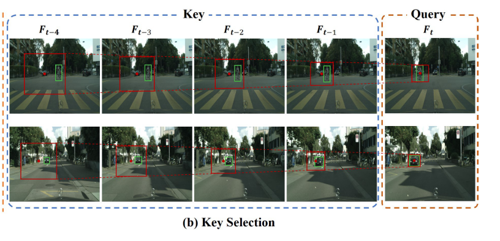
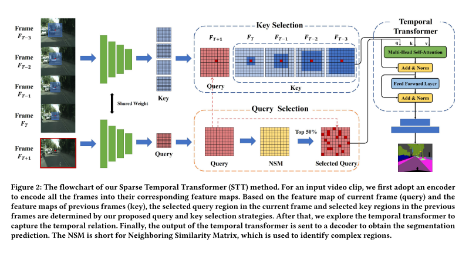
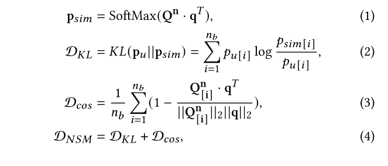
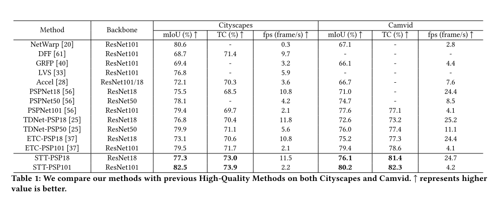

# Video Semantic Segmentation via Sparse Temporal Transformer

---

**URL:** https://dl.acm.org/doi/pdf/10.1145/3474085.3475409

**Code:** 

**Jnl/Conf:** MM 2021

**Rate:** ★★★★

---

## 论文简介
  对于视频语义分割面临的两大挑战：（1） 时间一致性要求 （2） 分割精度和推理效率之间的平衡。 对于第一个挑战，现有方法通过 optical flow 捕获连续帧之间的时间关系并保持时间一致性，但是其推理速度低，限制了实时应用。对于第二个挑战，基于 flow 的关键帧扭曲是现在的主流解决方案， 但是存在不平衡推理延迟使其无法满足实时应用要求。作者提出一种新的稀疏时间变换器（STT）来自适应桥接视频帧之间的时间关系，能够在不损坏分割精度和时间一致性的情况下，大幅降低时间变换的时间复杂度。
   

## 方法
  在现有的分割模型中加入一个 temporal transformer 作为自适应模块来捕获连续帧之间的时间关系。当前帧被视为查询帧，之前的几个帧被视为关键帧和值帧
  

在关键帧中，无需搜索整个区域，用适当的比例扩大搜索区域（红色区域）更加合适。对于查询帧中的每个查询点，先选择最近关键帧的小区域作为搜索区域，然后逐渐扩大到最远的关键帧， 称为 key selection， 基于此种选择策略，将时间复杂度从 O(Th^2w^2) 降低到 O(Thw), h,w 分别表示高度和宽度。
将query selection 和 key selection 集成到temporal transformer中 形成 稀疏 temporal transformer.
以下为整体网络结构：

实验中作者发现，复杂区域比简单区域对于图像分割精度和时间一致性的贡献更大，为了在精度和速度之间权衡，作者通过temporal transformer来蹭强分割效果，同时只关注相对复杂的区域，为了识别复杂区域，作者提出了结合盂县距离和KL散度的领域相似矩阵NSM方法来区分query 的特征映射中的简单区域和复杂区域。
给定一个领域半径 r , 一个坐标（u， v）,和一个 query feature map Q (h * w * dt), 得到feature point   q = Q[u][v], 然后定义Qn = Q[u-r:u+r][v-r:v+r], 将Qn扩展为2D的feature matrix, Qn(nb * dt), nb = (2r + 1)^2. NSM定义如下： 

给定 query feature map Q 和 领域半径 r， 首先计算Q中所有 feature point的 NSM, 并选择NSM值较大的50%来构建query set Q'.
本文的 key selection 策略就是定义三个超参数，起始大小 s, 终止大小 e, 膨胀系数 c. 则半径 l_t 的计算如下：

### 实验结果
  

## 创新点总结和思路借鉴

  1， 利用temporal transformer捕捉帧之间的关系， 将当前帧和前一帧作为查询的关键帧。
  2， 提出两种特征选择策略，即query选择和key选择，降低时间转换器的时间复杂度。
