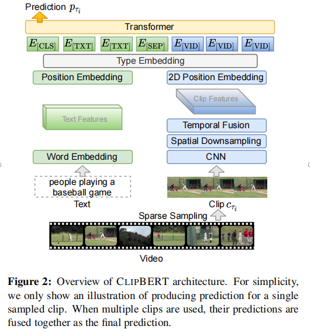
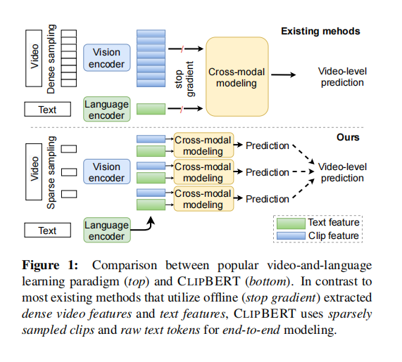

# Less is More: CLIPBETER for Video-and-Language Learning via Sparse Sampleing

---

**URL:** https://arxiv.org/abs/2102.06183

**Code:** https://github.com/jayleicn/ClipBERT

**Jnl/Conf:** CVPR 2021

**Rate:** ★★★★★

---

## 论文简介
目前视频--语言学习的学习方式是让模型从视觉模型中离线提取视觉密集视频特征和和语言模型中的文本特征中学习。但是由于特征提取器是独立的，一般用于和目标域不同的任务，这样的特征对下游任务并不是最佳的。另外，密集视频特征提取的计算量太大，直接将特征提取器插入到现有的方法来进行微调也很困难。为了解决上述问题，本文提出了CLIPBERT框架，通过稀疏采样来实现视频--语言任务端到端的学习。

## 方法

CLIPBERT中的特征表示不同于离线提取的单模态特征，而是通过直接从视频帧像素和于是文本语义学习联合表示。稀疏采样中的剪切片段使用视觉主干独立模型进行独立编码，视觉特征随后被反馈到跨模态块，跨模态块提取视觉特征和与其相关的文本表示之间的关系，来自所有视频片段的独立预测融合在一起，在视频级别上达成共识，然后在此基础上计算损失并学习模型参数。

离线提取密集视频特征和文本特征建模的方式：

视屏和对应文本分别用V和S表示，视频V可以进一步表示为N个时间相同视频片段的序列，例如，.  其中F_V^{SG} 和F_I^{SG} 表示视觉和语言编码器。上标SG表示停止梯度，意味着梯度不能通过两个编辑器反向传播。H是一个跨模态编辑器和预测器，它对编码的视频/语言输入 之间的关系建模并进行预测。p表示视频级的预测。然后用任务特定的损失函数Ltask来计算基于该预测和真实值q之间的损失值ltask， ltask = Ltask(p, q)。
clipbert并没有使用包含N个片段的全长视屏，而是在序列V中稀疏（并随机）采样N_train 个片段{C_Ti}, i=1, 2, …,N_train 。通常N_train<<N。对于一个抽样片段C_Ti 和文本输入S，产生一个预测P_Ti 。

损失值ltask根据以下视频级共识计算：

，N=Ntrain

G是预测/分数融合函数（例如，平均池化）。稀疏采样训练策略可以理解为一种类型的数据增强：在不同训练步骤中使用来自同一个视频的不同剪切子集，提高了模型的泛化能力.

## 创新点总结和思路借鉴

本文提出了CLIPBERT框架，并在实验中获得优于现有方法的效果。
文章中使用稀疏采样的方式进行模型训练，得到比密集提取的视屏特征更好的准确性。
文中使用图像--文本的预训练来帮助视频--文本学习，并证明图像--文本训练确实有利于视频--文本任务。
