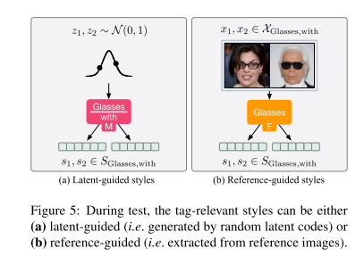

# Image-to-image Translation via Hierarchical Style Disentanglement
---

**URL:** https://arxiv.org/abs/2103.01456.pdf

**Code:** https://github.com/imlixinyang/HiSD

**Jnl/Conf:** CVPR 2021

**Rate:** ★★★★

---

## 论文简介

 本文是一片针对人脸进行属性编辑的论文，针对从CycleGAN提出后，图像翻译面临的最大的两个问题就是扩展性（同时处理多种篡改）和多样性（生成不同的结果），然而，一直没有一个很好的方法，可以兼顾扩展性和多样性的同时，又能使得这种篡改满足预期。例如，对于人脸属性篡改任务，我们想要给人脸加上刘海，可是却改变了发色或是背景，再例如，我们想要给人脸加上眼睛，结果竟然性别和年龄也改变了。
 针对以往方法不能单独控制独立的属性的缺点，设计了层级结构模型HiSD，同时支持从噪声中生成或者从图像中提取这样的风格。多属性之间完全没有干扰，而且多样性也可以非常好地对应上某个语义。
利用原始0-1标签之间存在的互斥性（对同一个语义的不同描述）和独立性（不同语义），HiSD将原始Label转换为了Tag和Attribute，无监督地解耦出对应上某个Attribute的风格，比如图中不同眼镜的款式，就可以达到可控多样性的目标了。
 虽然说是无监督的方法，但是只体现在训练的时候没有用到监督信息，但是在获取数据的时候，利用了标签信息，比如刘海、眼镜、头发颜色等，进行数据分组整理
## 方法

如上图所示，包含了图像重建损失和对抗损失。
 Non-translation、Self-translation和Cycle-translation各有一个重建损失，除此之外，对于style code也有一个重建损失，具体为M得到的s和Cycle-translation中间得到翻译图像经过F得到的s对于Cycle-translation中的输入图像、中间翻译的图像和最后的输出图像都进行的判别器的对抗损失，对抗损失里面会加入condition，防止无关属性被改动，比如背景、性别、年龄等

测试的时候先获取输入图像的表征e，之后通过向其中添加tag和attribute信息(有两种方式得到code,如上图)，经过T转化目标表征,最后通过Generater生成目标图像，多个tag需要通过多个T转化表征，一次添加相应的tag。

## 实验
 使用人脸数据集 CelebA-HQ,数据准备利用了标签信息
 

## 创新点总结和思路借鉴

（1）HiSD（Hierarchical Style Disentanglement）通过将标签组织成一个层次结构来解决最近的多标签和多样式图像到图像转换方法中的问题，其中独立标签、专有属性和纠缠的样式从上到下分配。

（2）要使标记和属性识别出样式，要重新设计模块、阶段和目标。对于无监督的样式分离，引入了两种体系结构改进，以避免全局操作和在转换过程中要操作的隐式属性。

