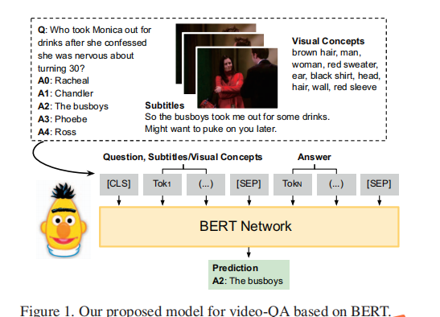
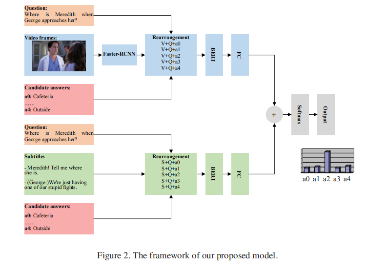

# BERT Representations for Video Question Answering

---

**URL:** https://openaccess.thecvf.com/content_WACV_2020/papers/Yang_BERT_representations_for_Video_Question_Answering_WACV_2020_paper.pdf

**Code:** https://github.com/jayleicn/ClipBERT

**Jnl/Conf:** WACV 2020

**Rate:** ★★★★

---

## 论文简介
  视觉问答（VQA)人任务有着十分重要的意义， 目前典型的VQA系统将图像和问题对作为输入，将它们的视觉和语言特征编码为高维向量，并使用attention机制对它们进行处理以预测正确答案。目前大多数视屏问答模型使用RNNs, 用LSTM对问题和字幕中的语言信息进行编码，但LSTM不擅长捕获长文本序列中的语义关系，本文使用BERT对视频片段中捕获的信息进行建模。

## 方法

    在图像字幕和视频回答任务中使用检测到的目标标签作为输入具有与直接使用CNN特征相当或者更好的性能，所以文章用检测到的目标特征来表示视频场景的实际内容，成为视觉概念特征。本文将视频问答作为多项选择任务来处理，从视频帧提取语义信息作为视觉概念，使用Faster-RCNN对视觉基因组数据集进行微调。字幕和视觉概念以及问题和候选答案分为两个独立流程进行，每个流程最终都使用微调的BERT网络来预测正确答案，两个流的输出被联合处理得到最终最终的预测。

## 创新点总结和思路借鉴

本文使用BERT对视屏片段的复杂语义进行编码，通过模型对视屏场景的字幕和视觉概念进行联合编码来捕获视屏场景的视觉和语言信息，在TVQA和Pororo取得了比之前工作更好的效果。
