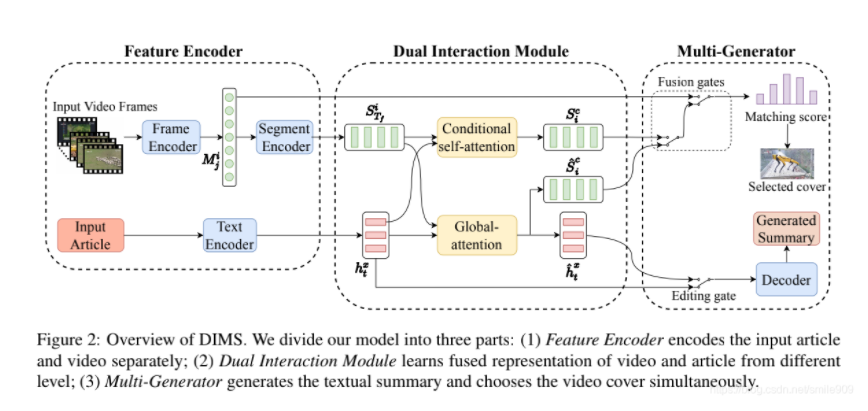
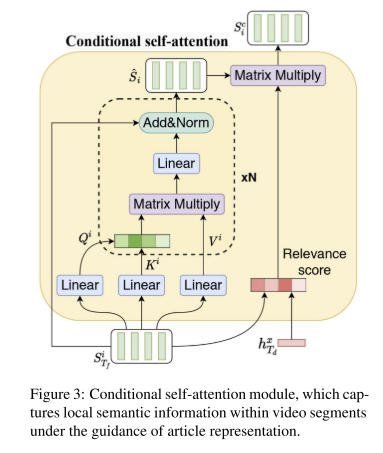
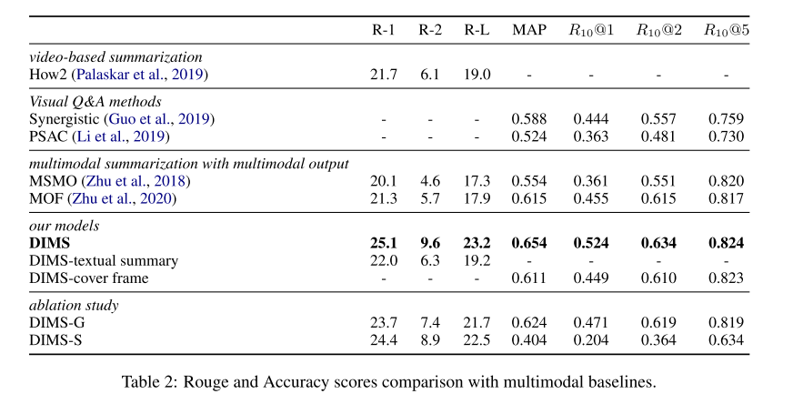

# VMSMO: Learning to Generate Multimodal Summary for Video-based News Articles

---

**URL:**  https://arxiv.org/pdf/2010.05406.pdf

**Code:** https://github.com/yingtaomj/VMSMO

**Jnl/Conf:** cs.CL 2020

**Rate:** ★★★★

---

## 论文简介

 文中提出了一个基于双交互的多模式摘要器（DIMS）模型，该模型通过在过程中执行双交互策略来学习同时摘要文章和视频。具体而言，我们首先采用递归神经网络（RNN）对文本和视频进行编码。注意，通过编码RNN，捕获视频中图像之间的空间和时间依赖关系。接下来，我们设计了一个双交互模块，让视频和文本充分交互。具体而言，我们提出了一种条件自我注意机制，在文章的指导下学习局部视频表征，以及一种全局注意机制，学习视频感知文章和文章感知视频的高级表征。最后，多模式生成器生成文本摘要，并基于最后一步的融合表示提取封面图像。为了评估我们模型的性能，我们收集了第一个与社交媒体网站视频封面相关的大规模新闻文章摘要数据集。对该数据集进行的大量实验表明，DIMS在常用指标方面显著优于最先进的基线方法。

## 方法

### Feature Encoder
  TextEncoder:对所有单词xi分别进行 one-hot 编码 : e(xi) ，使用双向递归神经网络 Bi-RNN 对单词之间的时间交互进行建模：
  
VideoEncoder:

  1 frame encoder:mi,j 表示第 i 段视频的第 j 帧， Fv 是一个线性转换。
  

  2 segment encoder:
  

### Dual Interaction Module
#### Conditional self-attention mechanism

 首先将片段表示通过全连接层投影到查询Q，键K，值V，然后自注意力机制的定义如下：
 

接下来，我们在文章的指导下突出视频的突出部分。以文章信息hTd^x 为条件，计算每个原始片段表征S_Tf^i 的注意得分为:

最终条件片段表示S_i^c 就是β_i (S_i ) ̂.

#### Global-attention mechanism
形式上，利用双向注意机制来获得编码文本表示ht^x 和编码片段表示S_Tf^i 之间的共同注意：

E_i^t  表示第 i 个视频片段在第 t 个单词上的注意权重，为了了解文本和片段信息之间的对齐，视频感知文章〖^h_t^x 和文章感知视频ˆS_i^c 的全局表示计算如下

### 实验结果

## 创新点总结和思路借鉴

1  作者提出了一种新的基于视频的具有多模态输出的多模态概括(VMSMO)任务，为视频选择适当的封面帧并生成文章的适当文本摘要。
2  提出了一种基于双交互的多模态概括器(DIMS)模型，该模型将视频的时间依赖与文章的语义意义联合建模，同时生成带有视频封面的文本摘要。
3  作者构造了一个VMSMO的大规模数据集，实验结果表明，作者的模型在自动和人工评估方面都优于其他基线
