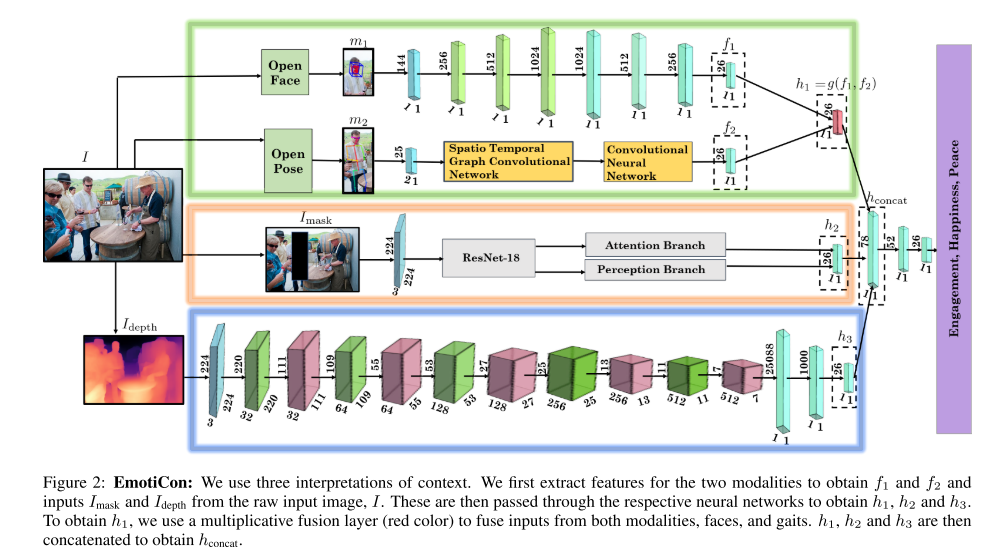
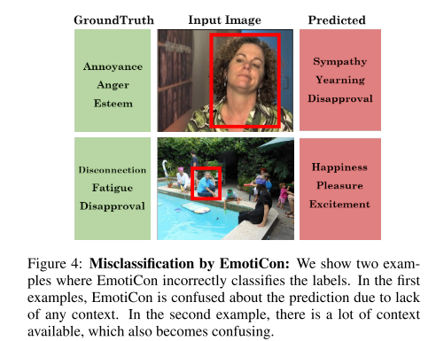

# EmotiCon: Context-Aware Multimodal Emotion Recognition using Frege’s Principl

---

**URL:** https://arxiv.org/pdf/2003.06692.pdf

**Code:** https://gamma.umd.edu/emoticon

**Jnl/Conf:** cs.CV 2020

**Rate:** ★★★★

---

## 论文简介

 情绪感知在生活中有着重要的作用，自动情绪识别也被用于多种应用中，比如人机交互，监控，机器人，游戏，娱乐等等。情绪识别最初是使用单一模式的方式，可能对应于面部表情，声音，文字，身体姿势，步态或生理信号。随后是多模态的识别，利用了多种模式的信号组合，从而推断情绪。受到弗雷格心理学的启发，作者结合了三种语境解释来进行情感识别：（1）基于多模态的进行情感识别（面部和步态） （2）从输入图像中收集语义上下文，并使用自注意力CNN来对信息进行编码 （3）使用深度图对社会动态互动和代理之间接近度的相关信息进行建模。通过结合三种语境解释，作者建立了情感识别模型，并得到了优于先前方法的识别准确率。
 
## 方法

上图为网络模型的结构，context 1 由 n 个流组成（本文中只用到了 face 和 pose 两个流），对应 n 个模态， 每个模态都输出一个特征向量 fi, 通过一个乘法融合为一个特征向量 h1 = g(f1, f2,...fn), h1  就表示 context 1 的输出特征向量， h2, h3 也通过相似得方法获得，并最终拼接成一个向量进入全连接层进行多标签的情感分类。

对于 context 1 ，用 OpenFace 提取面部特征，b并进行卷积操作，用 OpenPose 提取步态特征并接着使用 STGCN 的得到步态特征最终表示，并融合面部和步态特征，形成context 1 的特征向量。
对于 context 2 ，用 RobustTP 提取图像中的场景上下文信息（就是讲当前对象遮盖，提取出除了当前对象之外的其他图像信息），然后使用一个 Attention Branch Network 进行特征提取。
对于 context 3 ，用 Megadepth 提取出深度图 I_depth, I_depth (i, j) = d ( I( i, j), c) , d ( I( i, j), c) 表示（i， j）位置的像素到摄像中心的距离，并使用 GCN 来模拟代理之间基于接近度的socio-dynamic interactions（即在最后的全连接层前加两层图卷积操作）。

最后的特征 h_concat = [h1, h2, h3] 
损失函数 ： L_total = r1 * L_mulitiplicative + r2 * L_calssfication
L_mulitiplicative 是 context 1 中的损失：

L_calssfication 是软边距损失函数（soft margin loss function）

### 试验效果
 

## 创新点总结和思路借鉴

  1，提出了叫做EmotiCon的基于上下文感知的多模态情感识别算法，在此项工作中，作者尝试结合三种语境，从图像和视频中进行情感识别。
  2，提出使用基于深度卷积来模拟代理之间的 socio-dynamic interations。计算图像的深度图，并提供给网络，以了解代理之间的接近程度。
  3，发布了一个用于情绪识别的新数据集GroupWalk。
